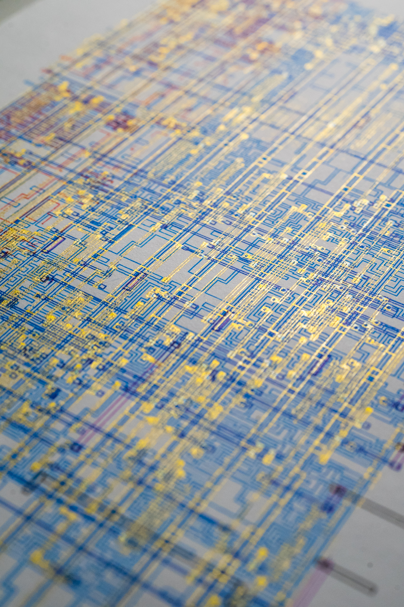

# Python3 GDSII to GCODE converter script

First rought version of this script to convert a GDSII files to simple GCODE

Each layer/datatype in the GDS gets its own gcode file

---
Python libraries requirements:  
`gdspy`


### Usage:
```
gds2gcode.py [-h] -i INPUT_GDS [-o OUTPUT_DIR] [-c CELL] [-pw PLOT_WIDTH] [-ph PLOT_HEIGHT] [-zm Z_MOVEMENTS_HEIGHT] [-zd Z_DRAWING_HEIGHT] [-zs Z_SAFE_HEIGHT] [-sz Z_SPEED] [-sxy XY_DRAWING_SPEED] [-cr CROP_RECT [CROP_RECT ...]]
```


### Arguments
```
  -h, --help            show this help message and exit
  -i INPUT_GDS, --input_gds INPUT_GDS
                        GDS file (default: None)
  -o OUTPUT_DIR, --output_dir OUTPUT_DIR
                        Output GCODE directory (one file per layer) (default: None)
  -c CELL, --cell CELL  Optional cell id to export. If not set the first top level cell is selected (default: None)
  -pw PLOT_WIDTH, --plot_width PLOT_WIDTH
                        Max plot width in mm (default: None)
  -ph PLOT_HEIGHT, --plot_height PLOT_HEIGHT
                        Max plot height in mm (default: None)
  -zm Z_MOVEMENTS_HEIGHT, --z_movements_height Z_MOVEMENTS_HEIGHT
                        Z height for not drawing movements (default: 1.0)
  -zd Z_DRAWING_HEIGHT, --z_drawing_height Z_DRAWING_HEIGHT
                        Z height for drawing movements (default: 0.0)
  -zs Z_SAFE_HEIGHT, --z_safe_height Z_SAFE_HEIGHT
                        Z height for safe movements at start and end (default: 15.0)
  -sz Z_SPEED, --z_speed Z_SPEED
                        Speed of Z axis movements (default: 300.0)
  -sxy XY_DRAWING_SPEED, --xy_drawing_speed XY_DRAWING_SPEED
                        Speed of XY axis movements when drawing (default: 1000.0)
  -cr CROP_RECT [CROP_RECT ...], --crop_rect CROP_RECT [CROP_RECT ...]
                        Crop rectangle in gds coords (x_min y_min x_max y_max ). Ex: -cr 0 0 140 200 (default: None)


example: 
gds2gcode.py -i design.gds -o somedir -c inverter -pw 260 -ph 215 -zm 2.0 -zd -0.1 -zs 15 -sz 100 -sxy 2000

```

### Notes

Tested on python 3.8

### Example plots





